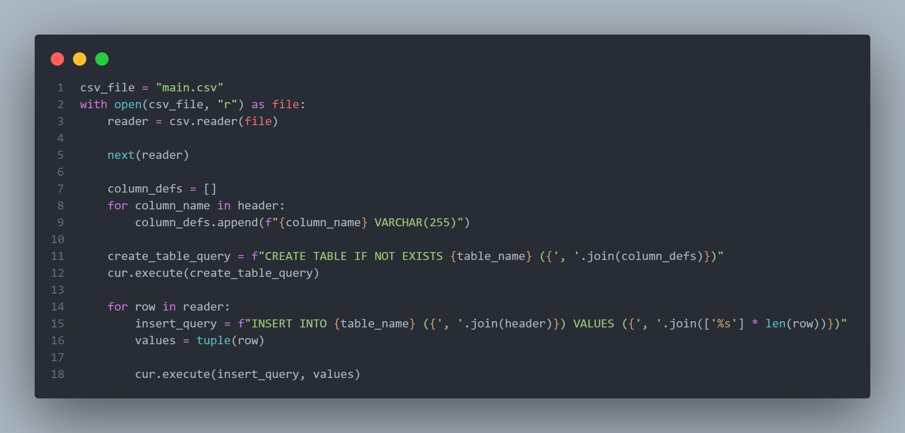

# MySQL CSV Importer

This script imports data from a CSV file into a MySQL database. It connects to a MySQL server, checks if the specified database exists (and creates it if it doesn't), then creates a table and imports data from the CSV file into that table.

## Prerequisites

1. Python 3.x
2. `mysql-connector-python` library
3. MySQL server

## Installation

1. **Clone the repository:**

   ```bash
   https://github.com/COMMANDO2406/CSVtoMySQL.git
   cd CSVtoMySQL
   ```

2. **Install the required Python packages:**

   ```bash
   pip install mysql-connector-python
   ```

3. **Change the `config.py` file:**

   ```python
   # config.py
   host = 'your_mysql_host'
   user = 'your_mysql_user'
   password = 'your_mysql_password'
   ```

4. **Prepare your CSV file:**
   Ensure you have a CSV file named `main.csv` in the same directory as the script. The CSV file should have a header row with column names matching the ones you will specify in the script.

## Usage

1. **Run the script:**

   ```bash
   python csv_to_mysql.py
   ```

2. **Enter the required information when prompted:**
   - **Database name:** Enter the name of the database you want to use. If it doesn't exist, it will be created.
   - **Table name:** Enter the name of the table where the data will be imported.
   - **Column names:** Enter the column names separated by commas. These should match the columns in your CSV file.

## Example

Here is an example of how to use the script:

1. **Prepare your CSV file (`main.csv`):**

   ```csv
   name,age,city
   Alice,30,New York
   Bob,25,Los Angeles
   ```

2. **Run the script:**

   ```bash
   python import_csv.py
   ```

3. **Enter the following when prompted:**

   ```
   Enter database name: my_database
   Enter table name: people
   Enter column names (Separated by commas): name,age,city
   ```

4. **The script will output:**

   ```
   Connected successfully
   Database 'my_database' created successfully
   Data imported successfully.
   ```

## How It Works

1. **Connects to the MySQL server:**
   The script connects to the MySQL server using the credentials specified in `config.py`.

2. **Checks if the database exists:**
   If the database does not exist, it creates the database.

3. **Creates the table:**
   The script creates a table with the specified name and columns if it doesn't already exist.

4. **Imports data from the CSV file:**
   The script reads the CSV file and inserts the data into the table.

## Main Logic



## Notes

- The column names you enter should match the columns in your CSV file.
- The script assumes that all columns in the CSV file are of type `VARCHAR(255)`. Modify the script if you need different data types.
- Make sure the `main.csv` file is in the same directory as the script or provide the correct path.

## License

This project is licensed under the MIT License - see the [LICENSE](LICENSE) file for details.
